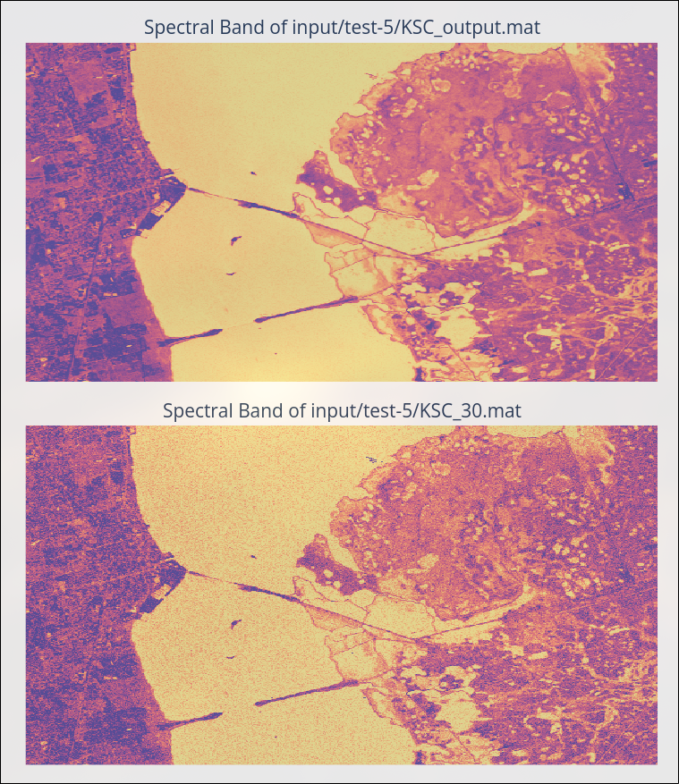

# ⚡ HSDT-Lightning
PyTorch Lightning ⚡ implementation of the [HSDT](https://arxiv.org/pdf/2303.09040) model for removing dark noise from hyperspectral images (HSI) — developed for the FINCH satellite by the University of Toronto Aerospace Team.

## 🚀 Features
- ⚡ Built with **PyTorch Lightning** for clean, scalable research
- 🔁 **Multi-GPU training** via Distributed Data Parallel (DDP)
- ⚙️ Fully configurable with **YAML-based CLI interface**
- 📄 **Well-documented**, modular, and strongly-typed codebase

Note that my companion notes can be found in [notion](https://utat-ss.notion.site/HSDT-Denoiser-aa306c141f8c4bbd8100d43efe740df1)



## 📦 Installing Dependencies
Create a virtual environment, and run
```bash
pip install -r requirements.txt
```

## 🗂️ Data Preparation
1. Create a `data` folder.
2. Create `raw` and `test` inside the `data` folder.
3. Download your hyperspectral images to train on into the `raw` folder.
4. Download your hyperspectral images to train on into the `test` folder.
5. (Optional to 6) Run `python -m preprocess.main`. 
6. (Optional to 5) Ensure data: preprocess_data is set to `true` inside the yaml config file

## ⚙️ Running the code
### 🔧 Training
```bash
python main.py fit --config config/models/hsdt.yaml
```

### 🔧 Training from a checkpoint
```bash
python main.py fit --config config/models/hsdt.yaml --ckpt_path checkpoint/hsdt-epoch10.ckpt
```

### 🔧 Running a smoke test
Run this when you want to see if your code is running or not.

```bash
python main.py fit --config config/models/hsdt.yaml --config config/local_debug.yaml --trainer.fast_dev_run=True --trainer.profiler=null
```

### 🔧 Best batch finder
```bash
python main.py fit --config config/models/hsdt.yaml --run_batch_size_finder true --batch_size_finder_mode power
```

### 🔧 Best learning rate finder
```bash
python main.py fit --config config/models/hsdt.yaml --run_lr_finder true --show_lr_plot true
```


### ✅ Validation
```bash
python main.py validate --config config/models/hsdt.yaml
```

### 🧪 Testing
```bash
python main.py test --config config/models/hsdt.yaml
```

### 🔮 Predict
```bash
python main.py predict --config config/models/hsdt.yaml

```

### 🆘 For help text
```bash
python main.py --help
```
Note that all the individual commands also have `--help`

### Reading Logs
```bash
tensorboard --logdir logs/hsdt_lightning
```

## 🆘 Running on remote server.
First, give permission for execution
```bash
chmod +x scripts/*
```

Second, setup the python environment & install the dependencies.
```bash
./scripts/setup.sh <PORT>
```

Third, install and setup SLURM for workload management
```bash
./scripts/install_slurm.sh
```

Fourth, run the training sequentially on all the models.
```bash
sbatch scripts/train_all_models_exclusive.sh
```


## 🧾 Project Structure
Overview of the project structure:

```

├── main.py               # Entry point using LightningCLI
├── model.py              # LightningModule for HSDT model
├── data_module.py        # LightningDataModule with transforms
├── dataset.py            # HSI dataset & patching logic
│
├── config/               # YAML configuration files
├── hsdt/                 # HSDT architecture (`hsdt/arch.py`)
├── metrics/              # Metrics: SSIM (`ssim.py`), PSNR (`psnr.py`)
├── preprocess/           # Preprocessing scripts (`main.py` is entry point)
│
├── data/                 # Input images for training/testing
│   ├── raw/              # Raw training data
│   └── test/             # Testing data
│
├── logs/                 # Lightning logs
│
└── checkpoints/
    ├── best/             # Best-performing checkpoints (highest PSNR/SSIM)
    └── interval/         # Checkpoints saved every 5 epochs

```

## 🧰 Technologies Used
- [Pytorch Lightning](https://lightning.ai/docs/pytorch/stable/starter/introduction.html) - Training Loop Abstraction
- [Pytorch](https://docs.pytorch.org/docs/stable/generated/torch.nn.Module.html) - Deep learning framework
- [Scikit Image](https://scikit-image.org/docs/0.25.x/api/skimage.metrics.html) - Image quality metrics (SSIM & PSNR)
- [Scipy](https://scipy.org/) - For loading/saving .mat files

For complete list, consult the `requirements.txt`
